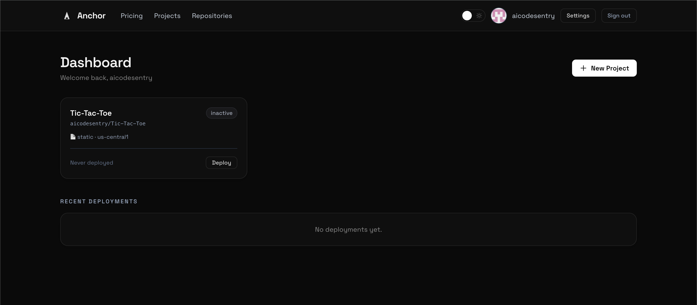
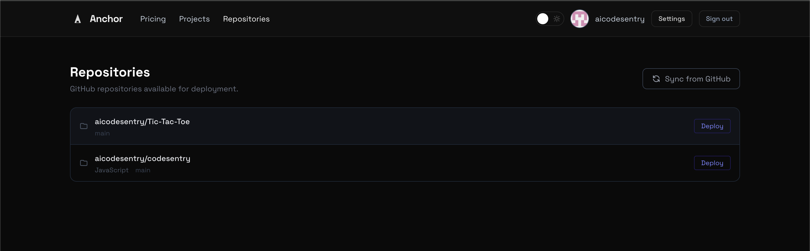

# Anchor

> Deploy any GitHub repository to the cloud — no Kubernetes, no YAML, no ops team.

Anchor connects to your GitHub account, detects your framework, generates a production Dockerfile, builds and deploys your app, and streams logs live to your browser. When something fails, Claude explains what went wrong in plain English.

**Your infrastructure. Your cloud bill. Anchor is just the control plane.**

### Cloud providers

| Provider | Status |
|---|---|
| Google Cloud Run | ✅ Live |
| AWS | Coming soon |
| Azure | Coming soon |
| DigitalOcean | Coming soon |
| Fly.io | Coming soon |
| Hetzner | Coming soon |
| Oracle Cloud | Coming soon |
| Cloudflare | Coming soon |
| Linode | Coming soon |
| Vultr | Coming soon |

Anchor will automatically pick the best free tier across every major cloud — so you get the most out of your infrastructure without paying more than you need to.

---

## Screenshots





---

## How it works

```
GitHub repo  →  Framework detection  →  Dockerfile generation
     ↓
Cloud build  →  Container image  →  Container registry
     ↓
Cloud compute  →  Live URL  →  Health check
     ↓
(on failure)  →  Claude explains what went wrong
```

1. Sign in with GitHub
2. Pick a repository — Anchor syncs your repos via the GitHub API
3. Connect your cloud account (currently Google Cloud — OAuth or service account key)
4. Add secrets — encrypted at rest, injected at deploy time
5. Click **Deploy** — watch logs stream live in your browser
6. Get a public URL

Auto-deploy on push is available via GitHub webhook. CI/CD workflow files can be generated and committed directly from the UI.

---

## Tech stack

| Layer | Technology |
|---|---|
| Framework | Ruby on Rails 8.1.2 |
| Ruby | 3.4.4 |
| Database | PostgreSQL 15+ |
| Background jobs | Sidekiq 8 + Redis 7 |
| Frontend | Hotwire (Turbo Streams + Stimulus) + Tailwind CSS v4 |
| Real-time | ActionCable over Redis |
| Auth | OmniAuth — GitHub OAuth2 + Google OAuth2 |
| GitHub API | Octokit 10 |
| Encryption | attr_encrypted (AES-256-CBC) |
| AI | Anthropic Claude — error explanation + repo analysis |
| Rate limiting | Rack::Attack |
| Web server | Puma + Thrust |

---

## Prerequisites

- Ruby 3.4.4 (`rbenv` or `mise`)
- PostgreSQL 15+
- Redis 7+
- [`gcloud` CLI](https://cloud.google.com/sdk/docs/install)
- A [GitHub OAuth App](https://github.com/settings/applications/new)
- A Google Cloud project with billing enabled

---

## Local development

### 1. Clone and install

```bash
git clone https://github.com/nebullii/anchor.git
cd anchor
bundle install
```

### 2. Create a GitHub OAuth App

Go to **GitHub → Settings → Developer settings → OAuth Apps → New OAuth App**:

| Field | Value |
|---|---|
| Homepage URL | `http://localhost:3000` |
| Authorization callback URL | `http://localhost:3000/auth/github/callback` |

### 3. Create a Google OAuth App *(required for GCP integration)*

Go to [Google Cloud Console → APIs & Services → Credentials](https://console.cloud.google.com/apis/credentials) → Create OAuth client ID:

| Field | Value |
|---|---|
| Application type | Web application |
| Authorized redirect URI | `http://localhost:3000/auth/google_oauth2/callback` |

### 4. Configure credentials

```bash
EDITOR="nano" bundle exec rails credentials:edit
```

```yaml
github:
  client_id: "YOUR_GITHUB_CLIENT_ID"
  client_secret: "YOUR_GITHUB_CLIENT_SECRET"

google:
  client_id: "YOUR_GOOGLE_CLIENT_ID"
  client_secret: "YOUR_GOOGLE_CLIENT_SECRET"

encryption:
  key: "your-32-byte-hex-key"   # ruby -e "require 'securerandom'; puts SecureRandom.hex(16)"

anthropic:
  api_key: "sk-ant-..."          # optional — AI features degrade gracefully without it
```

### 5. Database setup

```bash
bundle exec rails db:create db:migrate
```

### 6. Start the server

```bash
bin/dev
```

Opens at [http://localhost:3000](http://localhost:3000). Runs Rails (port 3000) and Sidekiq via Foreman.

---

## Environment variables

| Variable | Required | Description |
|---|---|---|
| `RAILS_MASTER_KEY` | ✅ | Contents of `config/master.key` |
| `DATABASE_URL` | ✅ | PostgreSQL connection string |
| `REDIS_URL` | ✅ | Redis connection string |
| `GITHUB_CLIENT_ID` | ✅ | GitHub OAuth app client ID |
| `GITHUB_CLIENT_SECRET` | ✅ | GitHub OAuth app client secret |
| `GOOGLE_CLIENT_ID` | — | Google OAuth app client ID |
| `GOOGLE_CLIENT_SECRET` | — | Google OAuth app client secret |
| `ENCRYPTION_KEY` | — | 32-byte AES-256 key for at-rest encryption |
| `ANTHROPIC_API_KEY` | — | Enables AI error explanation and repo analysis |
| `GITHUB_WEBHOOK_SECRET` | — | HMAC secret for verifying GitHub webhook payloads |

---

## Architecture

### Models

| Model | Responsibility |
|---|---|
| `User` | Auth tokens (encrypted), GCP credentials, deployment quotas |
| `Repository` | GitHub repos synced via Octokit |
| `Project` | Cloud Run service definition, framework state, analysis results |
| `Deployment` | Full lifecycle record — status, logs, error category, AI explanation |
| `DeploymentLog` | Append-only log lines streamed live via Turbo |
| `DeploymentEvent` | Audit trail of every status transition |
| `Secret` | Encrypted env vars per project, injected into Cloud Run at deploy time |

### Deployment pipeline

Five jobs execute in sequence. Each hands off to the next only on success. Any failure marks the deployment `failed` and triggers the AI error explainer.

```
DeploymentJob
  └─ PrepareJob          # clone repo, detect framework, generate Dockerfile
       └─ BuildImageJob  # gcloud builds submit --async
            └─ PollBuildStatusJob      # polls Cloud Build with exponential backoff
                 └─ DeployToCloudRunJob  # gcloud run deploy + health check
                      └─ ExplainErrorJob  # (on failure only) Anthropic Claude
```

### Status machine

```
queued → analyzing → building → deploying → health_check
       → success | failed | cancelled
```

### Real-time streaming

Every deployment streams two Turbo Stream channels to the browser:

| Channel | Carries |
|---|---|
| `deployment_<id>` | Status badge, pipeline steps, outcome panel |
| `deployment_<id>_logs` | Individual log lines appended to the terminal UI |

---

## Supported frameworks

Rails · Node.js · Next.js · Bun · Python · FastAPI · Flask · Django · Elixir · Static · Docker

---

## Running tests

```bash
bundle exec rspec          # full suite
bundle exec rspec spec/models
bundle exec rspec spec/jobs
bundle exec rspec spec/services
```

The test suite uses WebMock — no real GitHub or GCP calls are made.

---

## Security

- All OAuth tokens and secrets are encrypted at rest with AES-256-CBC
- Google OAuth tokens are refreshed automatically before expiry
- GitHub webhook payloads are verified with HMAC-SHA256
- Temporary GCP credential files are written to `Tempfile` and deleted immediately after use
- CSRF protection is enabled on all non-webhook endpoints
- Rate limiting via Rack::Attack: 300 req/5 min per IP, 20 deploys/hour per user

---

## Contributing

1. Fork and create a branch: `git checkout -b feature/my-feature`
2. Make your changes with tests
3. Ensure the suite passes: `bundle exec rspec`
4. Open a pull request against `main`
