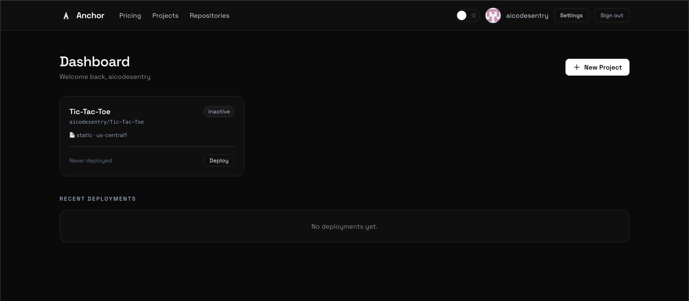
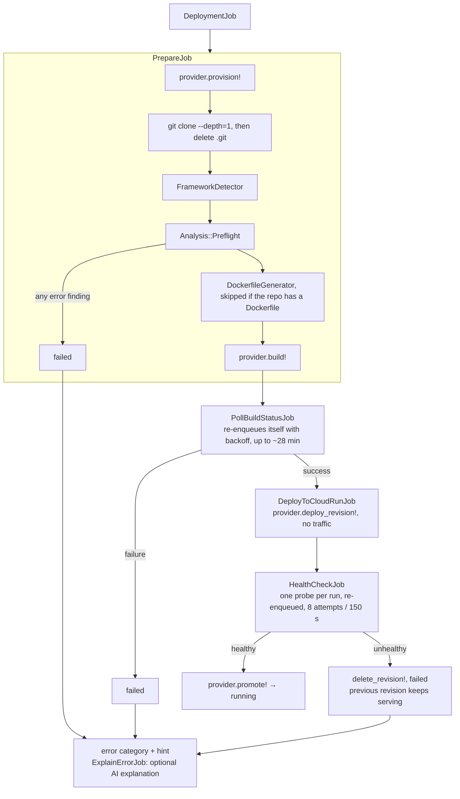

<p align="center">
  
</p>

<h1 align="center">Anchor</h1>

<p align="center">
  <strong>An open-source control plane that deploys GitHub repos into your own cloud account.</strong>
</p>

<p align="center">
  <a href="https://github.com/nebullii/anchor/actions/workflows/ci.yml"></a>
  
  
  
  <a href="LICENSE"></a>
</p>

---

You point Anchor at a GitHub repository. It detects the framework, runs preflight checks, writes a
Dockerfile if the repo has none, builds an image, and starts a new revision in **your** cloud account.
The new revision gets traffic only after it passes a health check. If the health check fails, the
previous revision keeps serving. If a release goes out and turns out to be broken, one command moves
traffic back to the previous revision without a rebuild.

Anchor is only the control plane. The containers run in your account, on your bill.

- **Health-gated releases.** A new revision is started without traffic, probed over HTTP, and only then promoted.
- **One-click rollback.** Moves traffic back to an earlier healthy revision without rebuilding.
- **Preflight checks.** 34 static rules catch problems such as binding to `localhost`, a missing `go.sum`, or a committed `.env`. They run before a build starts, so a doomed deploy never costs a cloud build.
- **CLI and MCP server.** `anchor deploy --follow` works as a CI gate, and coding agents (Claude Code, Cursor) can deploy, read logs, and roll back through the MCP server.
- **Local Docker provider.** Try the full pipeline on a laptop with no cloud account.

> **Status: beta.** Google Cloud Run is the only real cloud provider. See [Status and known gaps](#status-and-known-gaps).

## Quickstart: local Docker, no cloud account

You need Ruby 3.4.4, PostgreSQL 16, Redis 7, Docker, and Go 1.22+ (for the CLI).

```bash
git clone https://github.com/nebullii/anchor.git && cd anchor
bin/setup                 # checks tools, writes .env, installs gems, creates + seeds the DB, starts bin/dev
```

Open http://localhost:3000, click **Continue as demo user**, and open the seeded `hello-anchor`
project. It points at a small public sample repo and uses the Local Docker provider. Press **Deploy**.

To do the same from the terminal, create a token under **Settings → API tokens**, then:

```bash
cd cli && go build -o anchor . && cd ..
./cli/anchor login --url http://localhost:3000      # paste the anc_... token
./cli/anchor deploy hello-anchor --follow
```

```text
Deploying hello-anchor (branch master) — deployment #4. Ctrl-C to stop following.
==> queued
11:18:10 Deployment queued — starting pipeline (provider: local_docker).
...
11:18:13 Revision anchor-cl-hello-anchor-4 created at http://localhost:51444.
11:18:13 Health check 1/8 passed (HTTP 200).
11:18:13 Shifting 100% of traffic to anchor-cl-hello-anchor-4...
11:18:13 Deployment complete.

✔ Deployment #4 is live: http://localhost:51444
```

On a warm machine this takes about 3 seconds and exits 0. Deploy a second time, then run
`./cli/anchor rollback hello-anchor`. Traffic returns to the previous container in about a second, and
the superseded deployment is marked `rolled_back`.

No local Ruby or Postgres? Run `docker compose up` instead. The first build takes about 4 minutes.
See [docs/quickstart.md](docs/quickstart.md) for both paths and for troubleshooting.

## How a deployment works

Every step is a Sidekiq job that takes only the deployment ID, so any worker can pick up any step.
No local path is passed between jobs.


```mermaid
flowchart TD
    A[DeploymentJob] --> P
    subgraph P[PrepareJob]
      P1[provider.provision!] --> P2[git clone --depth=1, then delete .git]
      P2 --> P3[FrameworkDetector]
      P3 --> P4[Analysis::Preflight]
      P4 -->|any error finding| F1[failed]
      P4 --> P5[DockerfileGenerator, skipped if the repo has a Dockerfile]
      P5 --> P6[provider.build!]
    end
    P6 --> B[PollBuildStatusJob<br/>re-enqueues itself with backoff, up to ~28 min]
    B -->|failure| F2[failed]
    B -->|success| D[DeployToCloudRunJob<br/>provider.deploy_revision!, no traffic]
    D --> H[HealthCheckJob<br/>one probe per run, re-enqueued, 8 attempts / 150 s]
    H -->|healthy| PR[provider.promote! → running]
    H -->|unhealthy| F3[delete_revision!, failed<br/>previous revision keeps serving]
    F1 & F2 & F3 --> E[error category + hint<br/>ExplainErrorJob: optional AI explanation]
```

- **Rollback.** `Deployments::Rollback` creates a new deployment (`triggered_by: "rollback"`) that
  points at an earlier healthy revision. `RollbackJob` calls `provider.rollback!`, marks the
  previously live deployment `rolled_back`, and marks the new one `running`. Nothing is rebuilt.
- **Reaper.** `Deployments::ReaperJob` runs every 5 minutes. It fails deployments that have been stuck
  in one status too long (for example 45 minutes in `building`), which frees the project's
  one-active-deployment slot. It also cancels the stuck build on a best-effort basis.
- **State machine.** The flow is `queued → analyzing → building → deploying → health_check → running`,
  and any in-progress status can move to `failed` or `cancelled`. A `running` deployment can move to
  `rolled_back`. `Deployment#transition_to!` row-locks the deployment and raises on an illegal move.
  A partial unique index allows only one active deployment per project.
- **Retries.** Provider errors are classified as permanent or transient. Transient errors (rate
  limits, 5xx, network) get a bounded number of retries, and the deployment is failed when they run
  out. It is never left hanging.

The name `DeployToCloudRunJob` is historical: the job calls whichever provider the project uses.

## Providers

| Provider | Key | Status | Use it for |
|---|---|---|---|
| Local Docker | `local_docker` | Works. Free. | Trying Anchor and developing on it. Builds and runs containers on the machine that runs the Anchor worker, bound to `127.0.0.1`. Builds are not sandboxed, so do not point it at untrusted repos on a shared host. |
| Google Cloud Run | `gcp_cloud_run` | Supported (beta) | Real deployments into your GCP project. Builds with Cloud Build, pushes to Artifact Registry, and serves from Cloud Run, using `--no-traffic` revisions and tagged URLs for health checks. |
| AWS, Azure, Fly.io, Kubernetes | — | Not implemented | Planned. The provider interface is designed for them, but none exist yet. |

Adding a provider means writing one subclass of `Providers::Base` and adding it to
`Providers::REGISTRY`. No job changes are needed. See [docs/providers.md](docs/providers.md).

## CLI and MCP

- **CLI** (`cli/`, one static Go binary): `login`, `whoami`, `projects`, `link`, `status`, `deploy [-f]`,
  `logs [-f]`, `cancel`, `rollback [--to ID] [-f]`, `secrets list|set|unset`, and `doctor`. Exit codes
  are designed for CI: 0 means live, 1 means failed, cancelled, or rolled back. See [docs/cli.md](docs/cli.md).
- **MCP server** (`mcp/`, plain Node 18+, no dependencies) with 11 tools: `list_projects`,
  `get_project`, `get_analysis`, `list_deployments`, `deploy` (optionally waits for the result),
  `get_deployment`, `get_logs`, `cancel_deployment`, `rollback`, `list_secrets`, and `set_secret`.
  See [docs/mcp.md](docs/mcp.md).
- **JSON API** (`/api/v1`, bearer-token auth). The CLI and the MCP server both use it. See [docs/api.md](docs/api.md).

## Security

What the code does today, including the parts that are not finished:

- **App secrets** (per-project env vars) are encrypted with Active Record Encryption (AES-256-GCM,
  authenticated, key rotation through `ACTIVE_RECORD_ENCRYPTION_PRIMARY_KEY`). Rows written by older
  releases are still readable from their legacy AES-256-CBC columns (dual-read), and
  `Secret.reencrypt_legacy!` migrates them. The API and the CLI never return secret values.
- **Project webhook secrets** are also encrypted with Active Record Encryption.
- **User OAuth tokens and GCP service-account keys are still AES-256-CBC** (`attr_encrypted`, key =
  SHA-256 of `ENCRYPTION_KEY`). This is unauthenticated encryption, and moving these columns to GCM is
  an open follow-up.
- **Log redaction.** Every deployment log line passes through `Security::Redactor`, which removes the
  project's secret values, tokens embedded in URLs, bearer tokens, and common key formats. ANSI escape
  codes are stripped. Text sent to the LLM is redacted as well.
- **Clone tokens.** `.git` is deleted after the clone, so the tokened remote URL never reaches the
  build context or the image.
- **Webhooks.** Each delivery is verified with the project's own HMAC-SHA256 secret, using the
  `/webhooks/github?project=<slug>` URL. Deliveries are deduplicated on `X-GitHub-Delivery`, bodies
  are capped at 5 MB, and malformed input gets a 4xx. The shared global secret is accepted only when
  `ANCHOR_ALLOW_GLOBAL_WEBHOOK_SECRET=true`.
- **API tokens** start with `anc_`, are stored only as SHA-256 digests, are shown once, and can be
  revoked. Every token has full access to its account, because scopes do not exist yet.
- **Web.** The CSP is enforced, with per-request script nonces, `object-src 'none'` and
  `frame-ancestors 'none'`. Session cookies are secure and HTTP-only, HSTS is on, and `APP_HOSTS` sets
  the host allowlist. Rack::Attack throttles per IP, per user, and per API token. Deploy quotas are
  20 per day and 200 per month per user.
- **Generated CI/CD files** must pass `Security::GeneratedFilePolicy` before Anchor commits them to
  your repo.

See [SECURITY.md](SECURITY.md) for how to report issues and [docs/threat-model.md](docs/threat-model.md)
for the STRIDE analysis.

## AI features (optional)

When a deploy fails, the pipeline records an error category and a rule-based hint. Then
`ExplainErrorJob` runs. If `ANTHROPIC_API_KEY` or `OPENAI_API_KEY` is set, it asks the model for a
plain-English explanation of the redacted log tail. `ANCHOR_AI_PROVIDER=anthropic|openai|none` selects the provider, and Anthropic is used
when both keys are present. The same client powers optional repository-analysis enrichment and CI/CD
workflow generation. Without a key, every AI feature is a no-op and deploys work the same way.

## Status and known gaps

Anchor is **beta**. The pipeline, rollback, API, CLI, and MCP server have test coverage: 1,003 RSpec
examples plus Go and Node test suites, all run in CI. The known gaps:

- **One real cloud.** Google Cloud Run is the only cloud provider. Local Docker is for development.
- **First Cloud Run deploy is not health-gated.** Cloud Run rejects `--no-traffic` when it creates a
  new service, so the first revision gets traffic immediately. It is still health-checked, and it is
  marked failed if the check fails, but there is no older revision to fall back to.
- **Private Cloud Run services** (`public_access = false`) are probed without an identity token. A 403
  counts as "answering" and passes the check.
- **App secrets on Cloud Run** are passed as plain environment variables (`--env-vars-file`). Anyone
  with `run.services.get` on your GCP project can read them. Secret Manager integration for deployed
  apps is not built yet.
- **Not configurable from the UI or API:** `memory`, `health_check_path`, and `public_access`. The
  columns exist, with defaults of `512Mi`, `/`, and public, but today you can only change them from a
  Rails console.
- **Stale `running` status.** Deployments that were replaced by a newer normal deploy keep the status
  `running`. Only a rollback marks the one it replaces as `rolled_back`. The project's `url` and the
  newest `running` deployment are what is actually live.
- **Missing platform features:** managed databases, preview environments, custom domains, scaling
  controls, and multi-user teams or organizations.
- **API tokens have no scopes.** Every token has full access to its account.
- **User OAuth tokens** are still encrypted with AES-CBC (see [Security](#security)).
- **Local Docker builds are not sandboxed.** They run on the Anchor host.
- **Self-hosting Anchor on Cloud Run costs money.** The Sidekiq worker must run with
  `--min-instances=1`, which is roughly $45–55 per month per environment. See [SETUP_GCLOUD.md](SETUP_GCLOUD.md).

## Documentation

| | |
|---|---|
| [docs/quickstart.md](docs/quickstart.md) | Local setup: `bin/setup` or `docker compose` |
| [docs/cli.md](docs/cli.md) | The `anchor` CLI, with example output |
| [docs/mcp.md](docs/mcp.md) | Connecting Claude Code or Cursor |
| [docs/api.md](docs/api.md) | `/api/v1` reference |
| [docs/preflight.md](docs/preflight.md) | Every preflight rule |
| [docs/providers.md](docs/providers.md) | The provider interface and how to add a provider |
| [docs/comparison.md](docs/comparison.md) | How Anchor compares to similar tools |
| [SETUP_GCLOUD.md](SETUP_GCLOUD.md) | Google Cloud: deploy apps to Cloud Run, or host Anchor itself (paid) |
| [docs/deployment.md](docs/deployment.md) | Production deployment of Anchor (GitHub Actions → Cloud Run) |
| [docs/runbook.md](docs/runbook.md) · [docs/slo.md](docs/slo.md) | Operating Anchor |
| [CONTRIBUTING.md](CONTRIBUTING.md) · [CHANGELOG.md](CHANGELOG.md) | Development and release notes |

## Tech stack

Rails 8.1 · Ruby 3.4.4 · PostgreSQL 16 · Sidekiq 8 on Redis 7 · Hotwire (Turbo Streams, Stimulus) ·
Tailwind CSS v4 · OmniAuth (GitHub, Google) · Rack::Attack · Go (CLI) · Node (MCP server).

Supported framework detection: Rails, Node.js, Next.js, Bun, Python, FastAPI, Flask, Django, Go,
Elixir, static sites, and any repo with its own Dockerfile.

## License

[MIT](LICENSE)
